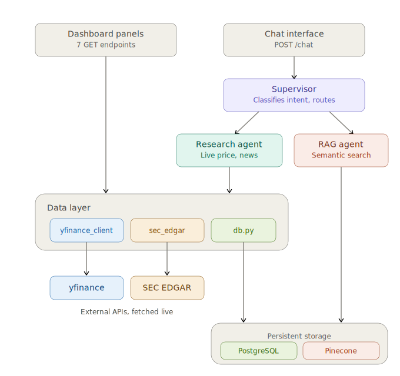
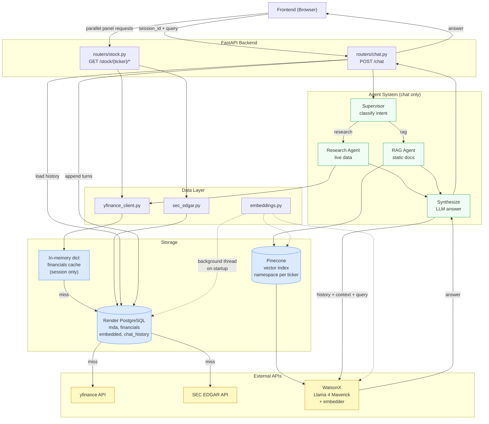

# Stock Research Dashboard — Backend

AI-powered stock research dashboard backend. Serves per-panel market data for a
set of tracked stocks (price, analyst ratings, financials, news, MD&A) and
powers a multi-agent chat interface grounded in that same data.

## Live Demo

- Frontend: [stock-dashboard-front-ow5x.onrender.com](https://stock-dashboard-front-ow5x.onrender.com)
- Backend API docs: [stock-dashboard-backend-1md0.onrender.com/docs](https://stock-dashboard-backend-1md0.onrender.com/docs)

Both are on Render's free tier, so the first request after a period of
inactivity can take 30-60 seconds to wake the service up.

## Tech Stack

| Layer | Tool |
|---|---|
| LLM | Llama 4 Maverick (`llama-4-maverick-17b-128e-instruct-fp8`) via WatsonX |
| Fallback LLM | Llama 3.3 70B (`llama-3-3-70b-instruct`) via WatsonX |
| Agent Framework | LangGraph |
| Vector DB | Pinecone |
| Relational DB | Render PostgreSQL |
| Backend | FastAPI |
| Data | yfinance + SEC EDGAR |
| Deploy | Render |

## Tracked Stocks

```
NVDA, AAPL, MSFT, GOOGL, META, TSLA
```

## Architecture

Dashboard panels are plain data-layer calls. Chat is the only thing that goes
through the agent system.

```
Dashboard (no agents)
├── /price       -> yfinance_client.py
├── /analyst     -> yfinance_client.py
├── /targets     -> yfinance_client.py
├── /earnings    -> yfinance_client.py
├── /financials  -> yfinance_client.py
├── /news        -> yfinance_client.py
└── /mda         -> sec_edgar.py

Chat (agents)
└── /chat        -> Supervisor
                        |-- Research Agent (yfinance + SEC EDGAR, live data)
                        |-- RAG Agent (Pinecone, static docs)
                        -> LLM synthesis -> answer
```

The **Supervisor** classifies query intent and decides which agent(s) to invoke —
Research Agent for fresh data (price/news/analyst), RAG Agent for retrieved
context (MD&A/financials), or both if intent is unclear. Both systems share the
same data-layer functions in `data/`; agents never call external APIs directly.



<details>
<summary>Mermaid version (source diagram, click to expand)</summary>



</details>

## Repo Structure

```
stock-dashboard-backend/
├── main.py                  # FastAPI app entry point
├── requirements.txt
├── agents/
│   ├── supervisor.py        # classifies query intent, decides which agents to invoke
│   ├── research_agent.py    # fetches fresh data from yfinance + SEC EDGAR
│   └── rag_agent.py         # Pinecone semantic search and context building
├── data/
│   ├── tickers.py           # single source of truth for tracked tickers
│   ├── yfinance_client.py   # all yfinance calls; holds in-memory financials dict
│   ├── sec_edgar.py         # SEC EDGAR 10-Q fetching and MD&A parsing
│   └── embeddings.py        # chunking and Pinecone upsert logic
├── docs/
│   └── architecture.svg     # architecture diagram used above
├── routers/
│   ├── stock.py             # GET /stock/{ticker} endpoints
│   ├── chat.py              # POST /chat endpoint
│   └── schemas.py           # shared Pydantic request/response models
├── scripts/
│   └── reset_data.py        # truncates Postgres + clears Pinecone for a clean re-embed
├── tests/
│   ├── test_endpoints.py
│   └── test_integration.py
└── utils/
    ├── db.py                # Render PostgreSQL read/write helpers
    └── watsonx.py           # WatsonX LLM and embedder setup
```

## Getting Started

```bash
# Install dependencies
python -m venv venv
source venv/bin/activate
pip install -r requirements.txt

# Run the backend
uvicorn main:app --reload
```

The backend runs on `http://localhost:8000` — API docs at `http://localhost:8000/docs`.

### Environment Variables

Create a `.env` file (never committed) with:

```bash
WATSONX_API_KEY=
WATSONX_PROJECT_ID=
WATSONX_URL=https://us-south.ml.cloud.ibm.com
PINECONE_API_KEY=
DATABASE_URL=
```

For local development, `DATABASE_URL` must be the **External Database URL**
from the Render dashboard (`dpg-xxx-a.oregon-postgres.render.com`) — the
internal hostname only resolves within Render's network.

### Startup Behavior

On boot, `init_db()` creates any missing Postgres tables synchronously, and the
server starts accepting requests immediately. A background task then embeds
each tracked ticker's MD&A and financials into Pinecone (skipping tickers
already marked done). The RAG agent may return sparse results for the first
minute or two after a cold deploy while this catches up.

## API Reference

### Dashboard panels

```
GET /stock/{ticker}/price         price history (yfinance)
GET /stock/{ticker}/analyst       analyst ratings + buy/hold/sell breakdown
GET /stock/{ticker}/targets       price targets low/mean/high/median
GET /stock/{ticker}/earnings      earnings estimates
GET /stock/{ticker}/financials    financials snapshot from ticker.info
GET /stock/{ticker}/news          recent news articles
GET /stock/{ticker}/mda           latest MD&A from SEC EDGAR 10-Q
```

<details>
<summary>Response shapes</summary>

```json
GET /stock/{ticker}/price
{ "dates": [...], "closes": [...], "volumes": [...] }

GET /stock/{ticker}/analyst
{ "strong_buy": 10, "buy": 8, "hold": 5, "sell": 1, "strong_sell": 0 }

GET /stock/{ticker}/targets
{ "current": 800, "low": 600, "mean": 850, "high": 1100, "median": 840 }

GET /stock/{ticker}/earnings
{ "estimates": [...] }

GET /stock/{ticker}/financials
{ "name": "...", "sector": "...", "market_cap": ..., "pe_ratio": ..., ... }

GET /stock/{ticker}/news
{ "articles": [{ "title": "...", "publisher": "...", "date": "...", "url": "..." }] }

GET /stock/{ticker}/mda
{ "filing_date": "...", "summary": "...", "full_text": "..." }
```

</details>

### Chat

```
POST /chat
```

```json
{
  "ticker": "NVDA",
  "query": "What do analysts think about NVDA and does recent news support that view?",
  "session_id": "uuid-generated-by-frontend"
}
```

```json
{
  "answer": "...",
  "sources": ["analyst", "news", "mda"],
  "chunks_used": 5
}
```

`session_id` is a UUID generated once by the frontend when a stock is selected
and sent on every message for that conversation — it is never passed via
request history. The backend loads prior turns from `chat_history` keyed by
`session_id`, then appends the new user + assistant turns after responding.

## Deployment

- Deploys as a Render Web Service connected to this repo — every push to `main`
  auto-redeploys.
- Env vars are set in the Render dashboard under the Environment tab;
  `DATABASE_URL` is injected automatically by the attached Postgres service.
- Render's filesystem resets on every deploy, so all persistence goes through
  Postgres or Pinecone — nothing is written to local disk.
- Cold start on the free tier takes 30-60 seconds after inactivity.

## Known Gotchas

- **yfinance can return `None`** for many fields — always guard with `.get()`
  and a default when reading its responses.
- **SEC EDGAR HTML parsing is fragile** — parsed MD&A is cached in Postgres
  after the first successful fetch and is never re-fetched while that row
  exists.
- **Pinecone free tier has index limits** — this project uses one index with a
  namespace per ticker rather than one index per ticker.
