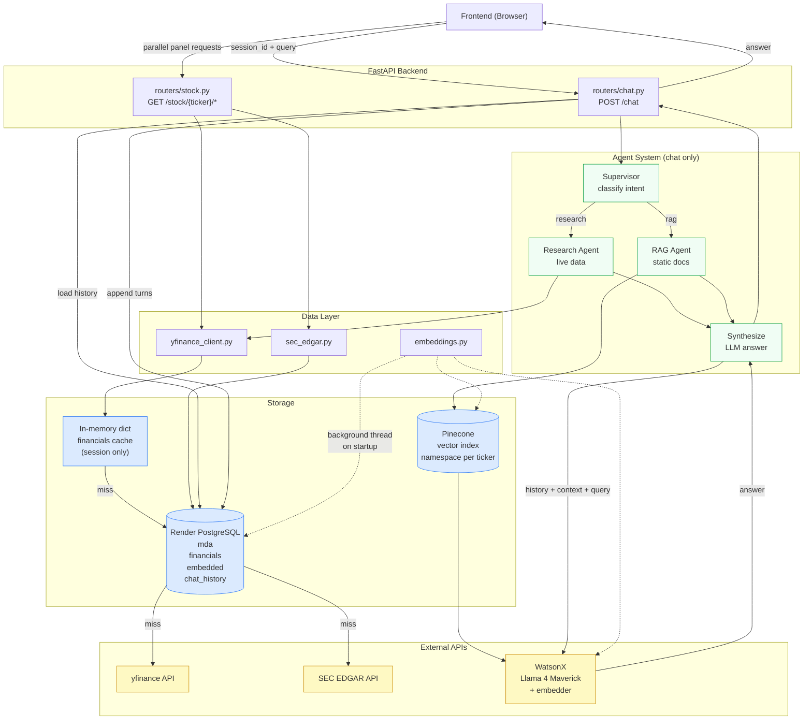

# stock-dashboard-backend

```
stock-dashboard-backend/
├── main.py                  # FastAPI app entry point
├── requirements.txt
├── .env                     # local only, never committed
├── .gitignore
├── agents/
│   ├── __init__.py
│   ├── supervisor.py        # classifies query intent, decides which agents to invoke
│   ├── research_agent.py    # fetches fresh data from yfinance + SEC EDGAR
│   └── rag_agent.py         # Pinecone semantic search and context building
├── data/
│   ├── __init__.py
│   ├── yfinance_client.py   # all yfinance calls; holds in-memory financials dict
│   ├── sec_edgar.py         # SEC EDGAR 10-Q fetching and MD&A parsing
│   └── embeddings.py        # chunking and Pinecone upsert logic
├── routers/
│   ├── __init__.py
│   ├── stock.py             # GET /stock/{ticker} endpoints
│   └── chat.py              # POST /chat endpoint
├── utils/
│   ├── __init__.py
│   ├── db.py                # Render PostgreSQL read/write helpers
│   └── watsonx.py           # WatsonX LLM and embedder setup
```

